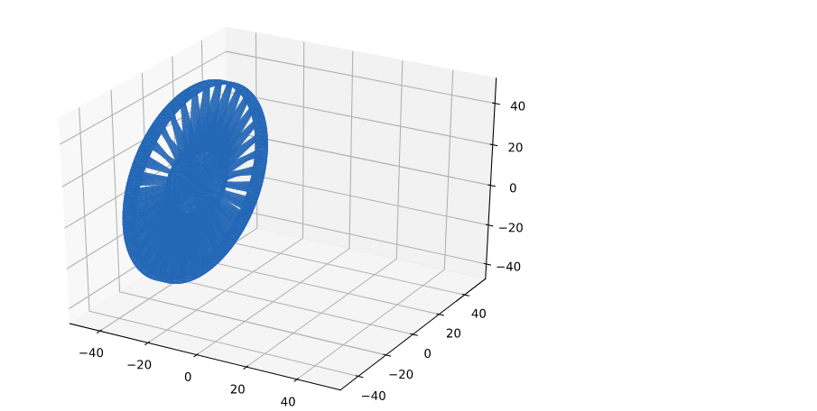

# Django App for manufacturing
***

### STL Extraction
One of the common files for manufacturing, next to step files, are stl files. This project writes a
small django application with a minimal web-user interface, that allows to upload a stl file
(you can find some in the file folder) and see the results. It extract from the file the
following data:
- bounding box with dimensions:
- x,y,z for square
- x and diameter for round
- x, diameter and thickness for round pipe
- x,y,z and thickness for rectangle pipes
  
Additionally, 
- volume and
- surface area of the object

### Homepage
Here is how your first page will appear after running the app. 


Now upload any .stl file and generate response. You will also see the 
object in a 3D plot at the end of the web page. Such as this:

### Visualize the stl object

This is the example of a plot which you can see at the end of the web page.



### How to run

Install dependencies from `requirements.txt`. To do so open terminal in project home directory and 
type: `pip install -r requirements.txt`. Then follow the following steps one by one. 

```.txt
In project terminal type:

1. python manage.py runserver
2. visit: http://127.0.0.1:8000/parser
3. Choose a stl file
4. Upload and wait depending on file size
```